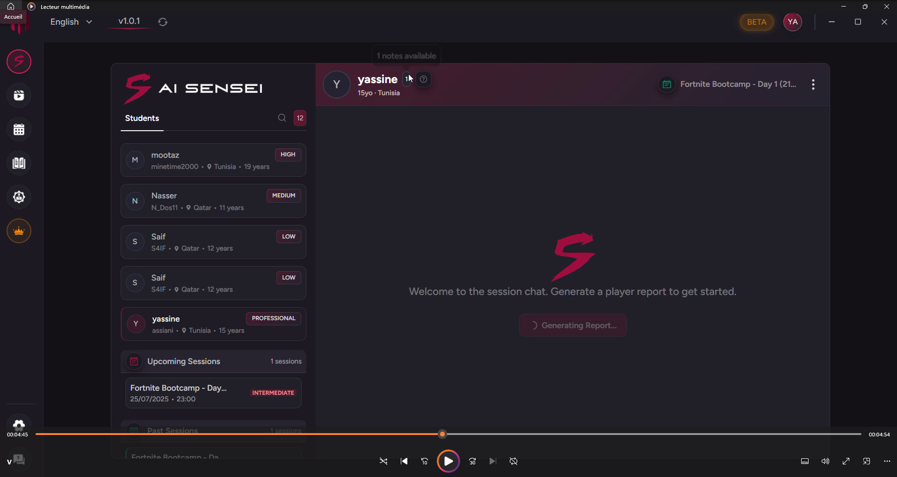

# MTsensei - Smart Esports Training System

Application complète de gestion et d'entraînement pour équipes et coachs esports au Qatar. Système intégrant gestion d'équipes, modules éducatifs, analyse de vidéos VOD, planification de sessions, et agent IA intelligent pour analyse automatique des performances, génération de rapports et recommandations personnalisées.

## 🎥 Démonstration Vidéo

**[▶️ Voir la démonstration complète](https://vimeo.com/1103401579)**

## 🤖 Agent IA Intelligent

Assistant IA avancé qui traite automatiquement les données des joueurs et équipes:

- **Analyse quotidienne**: Traitement des données de performance et génération de rapports structurés
- **Recommandations personnalisées**: Suggestions d'exercices adaptées au niveau de chaque joueur
- **RAG (Retrieval-Augmented Generation)**: Gestion intelligente des exercices avec récupération contextuelle et envoi automatique par email
- **Insights automatiques**: Détection de patterns et points d'amélioration

## 🎯 Application

Plateforme complète de gestion d'entraînement pour équipes esports, développée pour Qatar Esports:

- **Gestion d'équipes**: Management complet des joueurs, coachs et organisations
- **Système éducatif**: Modules de formation, exercices, sessions et projets
- **VOD Review**: Analyse de vidéos (Desktop, Twitch, YouTube) pour coachs
- **Planification**: Calendrier et suivi des sessions d'entraînement
- **Système premium**: Abonnements multi-niveaux (Coach Starter, Pro Coach, Academy & Org)

## 🛠️ Technologies

- **Frontend**: React.js (Interface moderne et responsive)
- **Backend**: Node.js (Architecture microservices)
- **Agent IA**: OpenAI (Analyse et recommandations intelligentes)
- **Bases de données**: MongoDB (Chat), PostgreSQL (Application)
- **Paiements**: Paddle (Système sécurisé)
- **Sécurité**: OAuth2, JWT, Rate limiter, Fail2ban
- **Infrastructure**: Docker, GitLab CI/CD, NGINX, SSL/HTTPS

## 🏆 Développé pour

**Qatar Esports** - Solution professionnelle pour coachs et organisations esports

---

*Smart AI-powered training management system for esports teams and coaches*
